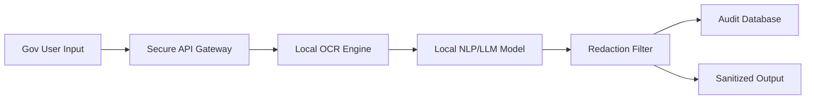

# Secure Public Sector Document Pipeline


## 📖 Overview
The **Secure Public Sector Document Pipeline** is a highly secure, offline-capable document analysis and redaction pipeline tailored for public sector, defense, and government AI use cases. It allows for the processing of sensitive, classified documents using isolated, locally-hosted AI models.

## ✨ Key Features
- **Automated PII Redaction:** Strictly identifies and redacts Personally Identifiable Information and classified markers.
- **Offline OCR & Processing:** Works entirely on-premise without reaching out to external cloud AI APIs.
- **Classified Document Summarization:** Generates high-level briefs of massive governmental policy PDFs.
- **Compliance Monitoring:** Maintains strict audit logs of who requested document processing and what changes the AI made.

## 🏗 System Architecture


## 📂 Repository Structure
- `ai_engine/`: Local HuggingFace/ONNX quantization models and redaction heuristics.
- `backend/`: Fast, synchronous API processing pipeline.
- `infra/`: Hardened Dockerfiles and network-isolated configurations.

## 🚀 Getting Started

### Local Development
To ensure maximum security, this project is designed to be run without external internet requirements once models are downloaded.
1. Clone the repository and install dependencies:
   ```bash
   pip install -r requirements.txt
   ```
2. Start the local processing server:
   ```bash
   uvicorn backend.main:app --host 0.0.0.0 --port 8000
   ```

## 🛠 Known Issues
- Enhance privacy-preserving synthetic data pipelines.

## 🤝 Contributing
Security-focused PRs, particularly those relating to strict memory management and vulnerability patching, are required.
